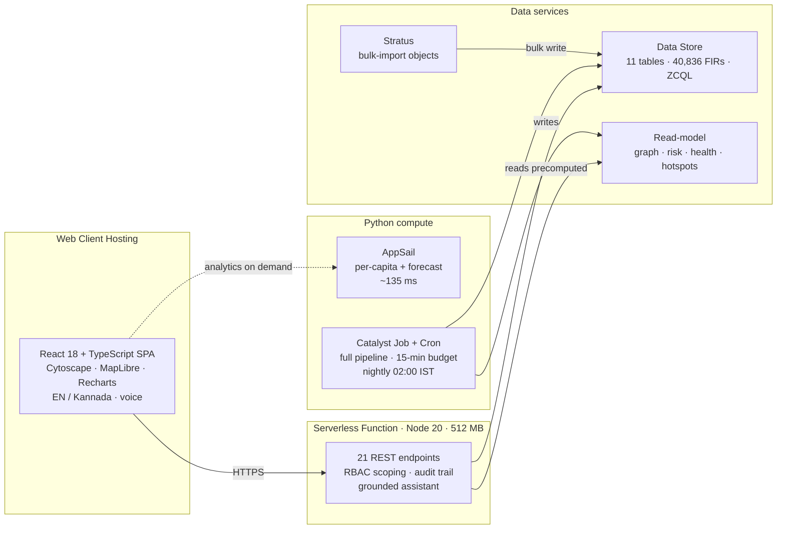
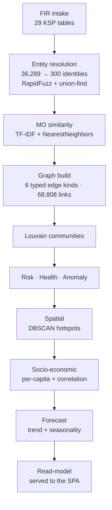

<div align="center">


# KADI — Karnataka Analytics & Detection Intelligence

**AI-Driven Crime Analytics & Visualization Platform for the Karnataka State Police**

*ಕಡಿ / कड़ी — "a link in a chain."*
Turning 40,836 siloed FIRs into one connected, explainable intelligence picture.

[](https://kadilabs-60078029367.development.catalystserverless.in/app/)
[](https://catalyst.zoho.com/)
[](#testing)
[](#evaluation--benchmarks)
[](#fairness-by-construction)

**[Live Application](https://kadilabs-60078029367.development.catalystserverless.in/app/)** ·
**[Analytics API](https://kadi-appsail-50043957273.development.catalystappsail.in/analytics/socio)** ·
**[Documentation](docs/)**

*KSP Datathon 2026 · Challenge 02 · Team KadiLabs*

</div>

---

## Table of Contents

- [The Problem](#the-problem)
- [What KADI Does](#what-kadi-does)
- [Screens](#screens)
- [The Headline Finding](#the-headline-finding)
- [Architecture](#architecture)
- [Catalyst Services](#catalyst-services)
- [The Dataset](#the-dataset)
- [Evaluation & Benchmarks](#evaluation--benchmarks)
- [Fairness by Construction](#fairness-by-construction)
- [Tech Stack](#tech-stack)
- [Getting Started](#getting-started)
- [Project Structure](#project-structure)
- [API Reference](#api-reference)
- [Testing](#testing)
- [Known Limitations](#known-limitations)
- [Roadmap](#roadmap)

---

## The Problem

The Karnataka State Police maintains extensive crime records. The records are not the problem —
**the walls between them are.**

| Today | Consequence |
|---|---|
| FIRs sit in station-level silos, analysed in Excel | A station sees its own register and nothing else |
| No entity resolution across name spellings | "Ravi Kumar", "R. Kumar" and "Ravikumar D" are three people |
| SCRB receives fragmented extracts | No state-wide picture to act on |
| Reporting is retrospective | Policing stays reactive; no early warning, no forecast |

A serial offender working across three districts is, in this arrangement, **invisible** — not
because the data is missing, but because nothing joins it.

---

## What KADI Does

<table>
<tr><td width="33%" valign="top">

### 🔗 Link Analysis

**Case-Linkage Graph**
Every FIR joined to every other FIR it shares real evidence with, across six typed link kinds.
Every edge is clickable proof — which attribute matched, on which FIRs.

**Entity Resolution**
Rarity-aware fuzzy matching folds **36,289** accused records into **300** real people, surviving
spelling variants, initials and transliteration drift.

</td><td width="33%" valign="top">

### 🗺️ Spatial & Predictive

**Spatiotemporal Map**
Satellite basemap, district choropleth, DBSCAN hotspots, hour × weekday layering, pulsing
red-zones for emerging trends.

**Crime Forecasting**
3-month district projections with a 95% interval — accuracy measured by hold-out backtest
(**MAPE 3.9%**), not asserted.

**Socio-economic Analytics**
Per-capita rates correlated against urbanisation, literacy and density, with p-values so weak
signals are labelled weak.

</td><td width="33%" valign="top">

### ⚖️ Operations & Trust

**Investigation Health**
Flags cases slipping past detection timelines — reporting delay, ageing vs peer median, pendency,
undetected-risk, false-case patterns — each with a recommended action.

**Bilingual Assistant**
Grounded EN / ಕನ್ನಡ Q&A by text or voice. Every answer cites real FIR numbers and deep-links into
the graph.

**Fairness & Audit**
Caste, religion and occupation excluded from every model — enforced by a failing unit test.
Sensitive reads are audited.

</td></tr>
</table>

---

## Screens

| Screen | What it shows |
|---|---|
| **Command Dashboard** | KPIs · monthly trend · hour × weekday heatmap · disposal funnel (39.6% clearance) · forecast with 95% band · crime-mix radial · urbanisation bubble plot · district treemap |
| **Case-Linkage Graph** | Ego-network per FIR · 5 layouts · 6 link-type filters · "why linked" evidence panel · case switcher |
| **Intelligence** | Per-capita ranking · rank-shift bars · correlation scatter · crime-mix by urbanisation band · state forecast |
| **Map** | Satellite/streets basemap · district drill-down · DBSCAN hotspots · log-normalised heat grid · time-of-day filter |
| **Investigation Health** | Worklist of 19,006 flagged cases with plain-language reasons and next actions |
| **Offenders** | Watchlist + profile: risk gauge · glass-box factor breakdown · name variants · linked FIRs |
| **Cases** | 40,836 FIRs filterable by head, district, status, gravity, health flag |
| **Assistant** | Bilingual grounded Q&A · voice input · briefing export |
| **About** | Full platform, dataset and fairness documentation |

> **Sign in by role** at the live URL — SI, Inspector, ACP, Analyst or Admin. Each rank is scoped
> **server-side** to exactly what it may see.

---

## The Headline Finding

Raw counts mostly measure **population**. Normalising to incidents per 100,000 residents changes
the map entirely:

| District | By raw count | Per 100k | FIRs | Rate |
|---|---:|---:|---:|---:|
| **Kodagu** | 30th | **6th** | 335 | 51.6 |
| **Dharwad** | 23rd | **7th** | 422 | 45.3 |
| Tumakuru | 10th | 24th | 806 | 25.7 |
| Belagavi | 4th | 14th | 1,859 | 33.2 |

335 FIRs looks unremarkable beside Bengaluru City's 16,895 — until you divide by Kodagu's 648,787
residents. **A count map would never surface it.**

**Socio-economic correlation** (n = 31 districts):

| Indicator | Pearson r | p | Strength |
|---|---:|---:|---|
| Population density | +0.889 | < 0.0001 | strong |
| Urbanisation | +0.878 | < 0.0001 | strong |
| Literacy | +0.538 | 0.0018 | moderate |

Urban districts run at **163.6** per 100k against **30.1** in rural ones — a 5.4× gap.

> ⚠️ **Stated openly:** the generator weights urban crime upward, so the urbanisation correlation
> is partly circular. The method is sound and runs unchanged on real KSP data — but this is
> confirmation, not discovery.

---

## Architecture



### The constraint that shaped everything

> **No heavy compute behind an HTTP request.**

The pipeline peaks at **~740 MB** and runs **~25 s**. Catalyst Functions *and* AppSail both cap a
request at **30 seconds** — confirmed by the Zoho team in the Datathon workshop, and not raisable.
Only **Jobs** get 15 minutes.

So the pipeline runs as a Job on a nightly Cron, and the web tier only ever *reads* what the Job
already wrote. That single decision is why every screen loads instantly instead of waiting on a
model.

### Pipeline stages



---

## Catalyst Services

### In use — eight services, each answering a constraint

| Service | Used for | Why this service |
|---|---|---|
| **Web Client Hosting** | Serves the SPA at `/app` | Same origin as the API; deep links handled with a 404 → shell fallback |
| **Serverless Functions** | 21-endpoint REST API + nightly Job | Advanced I/O accepts an Express app; raised to 512 MB for the read-model |
| **AppSail** | Python analytics service | Per-capita + forecast in ~135 ms; stdlib-only build |
| **Data Store** | 11 tables · 40,836 FIRs · live ZCQL | The FIR schema is genuinely relational |
| **Stratus** | Object storage for bulk import | Data Store bulk-write reads its source from a bucket |
| **Job Scheduling + Cron** | Nightly analytics revalidation, 02:00 IST | Only Jobs get 15 minutes |
| **Connections** | OAuth for QuickML (`deployment.READ`) | QuickML rejects anonymous calls |
| **Authentication** | Provisioned; role model shown at sign-in | RBAC scoping enforced server-side |

### Not wired — and exactly why

Listed deliberately. Each was attempted and diagnosed, not skipped.

| Service | Diagnosis |
|---|---|
| **Cache** | Adapter written, segment provisioned. Writes from inside a deployed function return `401 PERMISSION_NEEDED`. Ruled out by test: segment id, SDK presence, scope API, table permissions. Zero user impact — the KPI query recomputes in ~1 ms. |
| **QuickML** (GLM-4.7 + RAG) | Endpoint, model id (`crm-di-glm47b-30b-it`), `CATALYST-ORG` header and a valid OAuth token all confirmed working. The endpoint rejects our request body with `400 PATTERN_NOT_MATCHED` (*"error processing zoho-inputstream"*). Non-ASCII content, manual `Content-Length`, missing token and auth prefix each ruled out by test. Gated behind `QUICKML_ENABLED`. |
| **Zia** (STT / TTS / translate) | Not enabled on the project. Adapter includes the degradation the Zoho AI team recommended (Kannada → English → speak). Voice runs on the browser Web Speech API, client-side. |
| **NoSQL** | Never provisioned. The graph read-model ships in the function bundle; NoSQL is the right home at production scale. |
| **SmartBrowz** | Not wired. Briefing export returns print-ready HTML rather than claiming a PDF pipeline that does not exist. |
| **API Gateway** | Enabled once, then disabled: with no routes configured it intercepted all traffic and the site returned `INVALID_URL`. Needs route configuration first. |

> 💡 **Useful for anyone else building on Catalyst:** a Connection created in Cloud Scale
> **cannot be read by the SDK's `app.connection()`** — that API is for *self-managed* connectors
> and fails with `client_id cannot be null`.

---

## The Dataset

> **Every FIR is synthetic.** No real case, person or complainant appears anywhere. Real KSP records
> cannot leave KSP — so the corpus is *generated*, but generated against the real schema, real
> geography and real published statistics.

| | |
|---|---:|
| FIRs | **40,836** (43 months, Jan 2023 – Jul 2026) |
| Districts | 31 (all real KSP districts) |
| Police stations | 298 |
| Accused / Victims | 36,890 / 50,656 |
| Resolved offenders | 300 |
| Typed evidence links | 68,808 |
| Planted ground-truth patterns | 7 |

### How it is generated

1. **Real skeleton first** — 31 districts, 298 stations, the IPC/BNS/IT/NDPS section list and the
   KSP crime taxonomy come from the published schema, not invented.
2. **Volume from real statistics** — national and state totals set per-district magnitudes, so
   Bengaluru City carries ~16,900 FIRs while a small rural district carries a few hundred.
3. **Coordinates inside real boundaries** — incidents are rejection-sampled inside actual district
   polygons with urban clustering. **100%** of generated points fall inside Karnataka.
4. **Kannada name pool** with deliberate spelling variants, initials and transliteration drift —
   the noise that makes entity resolution a real problem rather than an exact-match lookup.
5. **Seven ground-truth patterns planted** — cross-district gang, serial burglary chain, cyber ring,
   repeat offender, slipping cases, false-case cluster, emerging hotspot.
6. **Deterministic** — seed `2026`; the corpus regenerates byte-for-byte, so every figure here is
   reproducible.

### Honest about fidelity

| Genuinely real | Where the synthetic origin shows |
|---|---|
| District names, boundaries, geography | MO narratives are template-drawn — cleaner than real free text |
| Census 2011 population, literacy, urbanisation (the per-capita denominator) | Urbanisation correlation is partly circular by construction |
| KSP table schema and CrimeNo format | Names from a finite pool make resolution slightly easier |
| IPC / BNS / IT Act / NDPS section numbers | No missing fields, typos or duplicate registrations |
| Relative crime volumes between districts | Real registers are messier |

Full specification: **[docs/06_SYNTHETIC_DATA_SPEC.md](docs/06_SYNTHETIC_DATA_SPEC.md)**

---

## Evaluation & Benchmarks

Because the patterns are **planted**, the pipeline can be *scored* rather than admired. This runs on
every pipeline execution.

| Pattern | Type | Recovery |
|---|---|---:|
| Cross-district chain-snatching gang (10 FIRs, 3 districts) | cluster | **100%** |
| Serial burglary chain (6 FIRs) | cluster | **100%** |
| Cyber-fraud ring — UPI/OTP (9 FIRs) | cluster | **100%** |
| Offender entity resolution (242 single-person identities) | identity | **100%** |
| Repeat offender out on bail → High risk band | risk | ✅ passed |
| Emerging MV-theft hotspot | hotspot | ✅ detected |

### Performance

| Metric | Value | Note |
|---|---:|---|
| Pipeline runtime | **24.6 s** | full recompute over 40,836 FIRs |
| Peak memory | **738 MB** | was 1,770 MB — see below |
| AppSail analytics | **135 ms** | against a 30 s request cap |
| Graph payload | **54.9 → 12.1 MB** | interned; evidence text byte-identical |
| Forecast MAPE | **3.9%** | hold-out backtest, 3 withheld months |
| API endpoints | **21/21** green | verified on the deployed build |
| Test suite | **19/19** | 8 Node + 11 Python |

<details>
<summary><b>How peak memory fell from 1,770 MB to 738 MB</b></summary>

<br/>

Catalyst Jobs cap memory at **512 MB**, so the pipeline could not have run there at all.

Profiling showed **1,216 MB of the 1,770 was a single scratch buffer**: scikit-learn's brute-force
`kneighbors` sizes its distance block from `working_memory`, which **defaults to 1 GiB** — twice
the entire Job budget. Capping it at 32 MB via a scoped `config_context`:

| `working_memory` | Peak RSS | Time | Pairs | Result hash |
|---|---:|---:|---:|---|
| 1024 MiB (default) | 1471 MB | 1.6 s | 67,906 | `fe0d204c…` |
| 64 MiB | 560 MB | 1.6 s | 67,906 | `fe0d204c…` |
| 32 MiB | **362 MB** | 1.6 s | 67,906 | `fe0d204c…` |

**Byte-identical output, zero speed cost.** The work was always the same — sklearn was just
allocating a gigabyte to do it.

</details>

<details>
<summary><b>How the graph payload fell from 54.9 MB to 12.1 MB</b></summary>

<br/>

70% of the adjacency file was an evidence blob, and most of it was redundant:

- `sourceFIRs` was always `[thisCase, neighbour]` — both already known at read time
- `matched[].detail` drew from **362 unique sentences** written out **137,616 times**

Dropping the first and interning the second into a shared table gives a **4.5× reduction** with the
exact same text rendering in the "why linked" panel. The API rehydrates through a `Proxy` that
expands one case's edges on access, so serving an ego-network never materialises the whole graph.

</details>

---

## Fairness by Construction

**Caste, religion and occupation never enter** entity resolution, linkage, risk scoring, or any
prediction — and that guarantee is *executable*:

```python
# appsail/pipeline/common.py
PROTECTED_COLUMNS = {"ReligionID", "CasteID", "OccupationID", "caste_master_id",
                     "caste_master_name", "ReligionName", "OccupationName"}


def assert_no_protected(feature_columns) -> None:
    """Raise if any protected attribute appears in a model's feature set."""
    used = PROTECTED_COLUMNS.intersection(set(feature_columns))
    if used:
        raise ValueError(f"FAIRNESS VIOLATION: protected attributes in feature set: {sorted(used)}")
```

A unit test fails the build if any protected column reaches a model's feature set. The claim is a
test, not a paragraph of policy.

**Explainability is enforced at every layer:**

- Every edge names the attribute that matched and the FIRs it matched on
- Every risk score shows its factor breakdown, not just a number
- Every assistant answer cites the FIR numbers it drew from
- Sensitive reads are written to an audit trail

---

## Tech Stack

<table>
<tr><th align="left">Frontend</th><th align="left">Backend</th><th align="left">Data & ML</th><th align="left">Platform</th></tr>
<tr valign="top"><td>

React 18
TypeScript
Vite
Tailwind CSS
Cytoscape.js + fcose
MapLibre GL
Recharts
Framer Motion
TanStack Query

</td><td>

Node.js 20
Catalyst Advanced I/O
Express-compatible routing
RBAC middleware
Audit trail
Grounded intent engine

</td><td>

Python 3.11
scikit-learn
networkx (Louvain)
RapidFuzz
pandas · NumPy · SciPy
Shapely

</td><td>

Zoho Catalyst
Catalyst CLI 1.27
ZCQL
node:test · pytest
GitHub

</td></tr>
</table>

---

## Getting Started

### Prerequisites

| Requirement | Version |
|---|---|
| Node.js | ≥ 20 |
| Python | ≥ 3.11 |
| Catalyst CLI | ≥ 1.27 (`npm i -g zcatalyst-cli`) — deployment only |

### 1 · Clone and install

```bash
git clone https://github.com/adarshcod30/Kadi.git
cd Kadi

# Python environment for the analytics pipeline
python3 -m venv .venv
source .venv/bin/activate                    # Windows: .venv\Scripts\activate
pip install -r appsail/requirements-dev.txt

# Node dependencies
cd functions && npm install && cd ..
cd client   && npm install && cd ..
```

> `appsail/requirements.txt` is intentionally empty — the deployed AppSail container cannot install
> packages, so that service is stdlib-only. Local and Job execution use `requirements-dev.txt`.

### 2 · Generate the dataset

Deterministic — seed `2026` reproduces the exact corpus behind every figure above.

```bash
python data/generator/generate.py --cases 40000 --out data/output
python data/generator/validate.py       # FK integrity · CrimeNo format · fairness chi-square
```

### 3 · Run the analytics pipeline

```bash
python appsail/pipeline/run_pipeline.py --data data/output
```

```
[   0.0s   188MB] loading source tables
[   0.2s   282MB] entity resolution
[  15.1s   379MB] MO similarity
[  16.7s   501MB] graph build + community detection
[  18.8s   755MB] offender risk scoring
...
[  25.7s   755MB] DONE in 25.7s — recovery 100.0% (pass=True)
```

### 4 · Build the deployable bundle

Trims the ~121 MB read-model to what the API actually serves.

```bash
python appsail/pipeline/build_bundle.py
```

### 5 · Run locally

```bash
# Terminal 1 — API on :9000
cd functions && DATA_DIR=../data/output node local-server.js

# Terminal 2 — SPA on :5173
cd client && npm run dev
```

Open **http://localhost:5173** and sign in as any role.

### 6 · Deploy to Catalyst

```bash
catalyst login
catalyst project:use KadiLabs --org <YOUR_ORG_ID> --dc in

cd client && npm run build && cd ..
catalyst deploy                              # client + functions + appsail
```

Full runbook: **[docs/07_CATALYST_SETUP.md](docs/07_CATALYST_SETUP.md)** ·
Live state: **[docs/08_CATALYST_LIVE.md](docs/08_CATALYST_LIVE.md)**

### Environment

Copy `.env.example` → `.env`. Everything runs without credentials; the optional keys only enable
QuickML and Zia.

| Variable | Default | Purpose |
|---|---|---|
| `KADI_BACKEND` | `mock` | `mock` reads generated files; `catalyst` uses SDK adapters |
| `DATA_DIR` | `data/output` | Where the generator writes |
| `QUICKML_ENABLED` | `false` | Opt-in; see [Known Limitations](#known-limitations) |
| `ZIA_ENABLED` | `false` | Server-side STT/TTS when available |

---

## Project Structure

```
Kadi/
├── client/                     React SPA — Catalyst Web Client Hosting
│   ├── src/pages/              14 route components (Dashboard · Graph · Intelligence · Map …)
│   ├── src/features/graph/     Cytoscape canvas + "why linked" evidence panel
│   ├── src/components/         Shared UI · illustrations · HomeAnalytics · AboutSections
│   ├── src/api/hooks.ts        TanStack Query hooks
│   └── src/lib/i18n.ts         EN / ಕನ್ನಡ dictionary
│
├── functions/
│   ├── api/                    Advanced I/O Function — the REST API
│   │   ├── app.js              21 routes · RBAC + audit wiring
│   │   ├── services/           queries · rbac · assistant · audit · cache · quickml · zia
│   │   └── data/               deployable bundle (built by build_bundle.py)
│   └── refreshanalytics/       Catalyst Job — nightly analytics revalidation
│
├── appsail/                    Python analytics — Catalyst AppSail
│   ├── app.py                  stdlib-only HTTP service
│   ├── pipeline/               16 modules — entity_resolution · mo_similarity · graph_build
│   │                           risk_score · health_metrics · anomaly · spatial · socio
│   │                           forecast · demographics · evaluate · build_bundle
│   ├── jobs/                   Job entry points
│   └── tests/                  pytest suite incl. the fairness invariant
│
├── data/
│   ├── generator/              Synthetic FIR generator (5 modules, seed 2026)
│   └── output/                 Generated CSVs + derived read-model (gitignored)
│
└── docs/                       PRD · TRD · schema · UI guidelines · data spec · Catalyst runbooks
```

---

## API Reference

Base URL (deployed):
`https://kadilabs-60078029367.development.catalystserverless.in/server/api`

Role is supplied via the `x-kadi-role` header — `SI` · `Inspector` · `ACP` · `Analyst` · `Admin`.

| Method | Endpoint | Returns |
|---|---|---|
| `GET` | `/health` | Liveness |
| `GET` | `/me` | Current user, capabilities, fairness statement |
| `GET` | `/stats` | Dashboard KPIs, trend, heatmap, status breakdown |
| `GET` | `/cases` | Paged FIR list — filter by head, district, status, gravity, flagged |
| `GET` | `/cases/:id` | Full FIR: parties, acts & sections, arrests, chargesheets, health |
| `GET` | `/graph/case/:id` | Ego-network with typed edges and evidence payloads |
| `GET` | `/graph/featured` | Networks with the richest link diversity |
| `GET` | `/graph/cluster/:id` | Full community subgraph |
| `GET` | `/offenders` · `/offenders/:id` | Watchlist and glass-box risk profile |
| `GET` | `/health/cases` · `/health/summary` | Investigation-health worklist and rollup |
| `GET` | `/geo/points` · `/geo/grid` · `/geo/hotspots` · `/geo/districts` | Map layers |
| `GET` | `/analytics/socio` | Per-capita rates, correlations, composition by band |
| `GET` | `/analytics/forecast` | 3-month projections + backtest accuracy |
| `GET` | `/eval` | Ground-truth recovery report |
| `GET` | `/ai/status` | Which AI services are actually wired |
| `POST` | `/assistant/query` · `/assistant/voice` | Grounded bilingual Q&A |
| `GET` | `/audit` | Audit trail (ACP / Admin only) |

**The headline finding, straight from the API:**

```bash
curl -s "https://kadilabs-60078029367.development.catalystserverless.in/server/api/analytics/socio" \
  -H "x-kadi-role: Analyst" \
  | jq '.data.districts[] | select(.rankShift > 5)
        | {district: .districtName, byCount: .rankByCount, byRate: .rankByRate, rate: .ratePer100k}'
```

**Or in ZCQL, against Catalyst Data Store:**

```sql
SELECT DistrictName, TotalCases, RatePer100k, RankByCount, RankByRate, RankShift
FROM DistrictInsight
WHERE RankShift > 5
ORDER BY RankShift DESC
```

---

## Testing

```bash
cd functions && npm test                     # 8 Node tests — API, RBAC, envelope
pytest appsail/tests data/generator -q       # 11 Python tests — pipeline, fairness, generator
```

The suite includes the **fairness invariant**: a test that fails the build if any protected
attribute reaches a model's feature set.

---

## Known Limitations

Stated plainly — every one is verifiable on the live URL.

| # | Limitation | Detail |
|---|---|---|
| 1 | **Authentication is not bound** | Catalyst Authentication is provisioned and the role model is presented at sign-in, but the API derives role from a header rather than a verified JWT. RBAC *scoping* is real and server-enforced; the identity check is not. One function — `userFromRequest` — is the seam. |
| 2 | **The API reads a bundle, not Data Store** | 40,836 FIRs are genuinely in Data Store and queryable via ZCQL, but the deployed API serves a precomputed bundle for sub-100 ms response. |
| 3 | **Audit log is in-memory** | A ring buffer, lost on cold start. Not yet persisted to Data Store. |
| 4 | **PDF export returns HTML** | Print-ready and styled; SmartBrowz is not wired. |
| 5 | **Cache · QuickML · Zia** | See [Catalyst Services](#catalyst-services) for the specific diagnosis of each. |
| 6 | **ZCQL joins need declared FKs** | Our columns are plain ints, so aggregates and filters work but `JOIN` does not. |
| 7 | **Correlation is partly circular** | The generator weights urban crime upward — see [The Dataset](#the-dataset). |

---

## Roadmap

| Priority | Item | Effort |
|---|---|---|
| 1 | Bind Catalyst Authentication — verified JWT in `userFromRequest` | Small |
| 2 | Read the API from Data Store via ZCQL behind the existing store interface | Medium |
| 3 | Complete QuickML + Zia once the request contract is confirmed with Zoho | Small |
| 4 | Persist the audit trail to a Data Store table | Small |
| 5 | Signals on FIR insert → incremental recompute instead of nightly rebuild | Medium |
| 6 | Extend the graph: vehicle numbers, phone/IMEI, bank accounts as link types | Medium |

---

<div align="center">

**Built for the Karnataka State Police · KSP Datathon 2026 · Challenge 02**

*Insights use evidence and behaviour only — never caste, religion, or occupation.*

[Live Application](https://kadilabs-60078029367.development.catalystserverless.in/app/) ·
[Documentation](docs/) ·
[Catalyst Setup](docs/07_CATALYST_SETUP.md)

</div>
