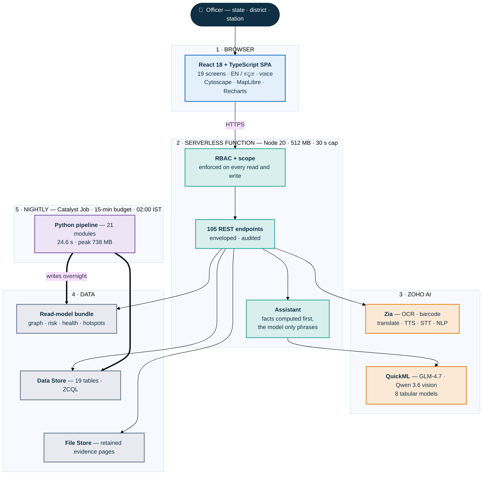
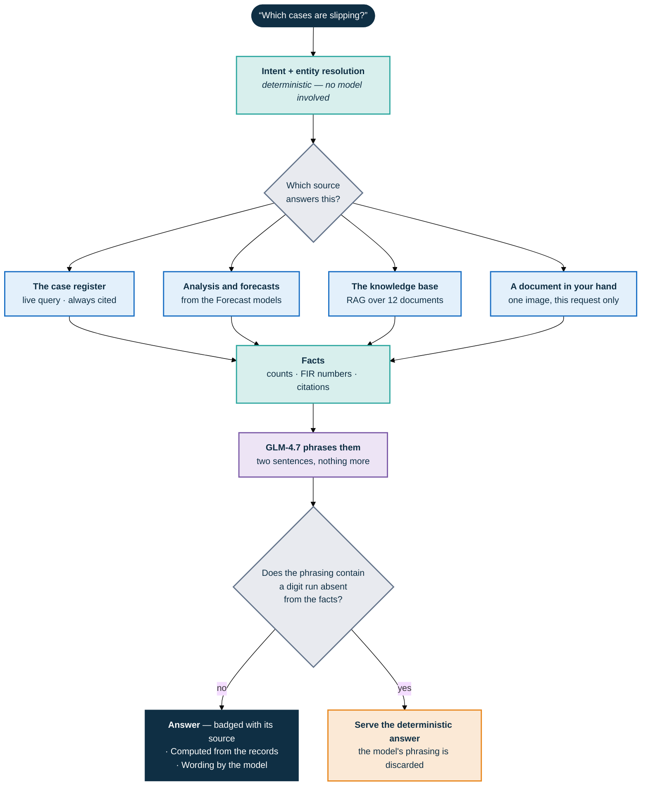
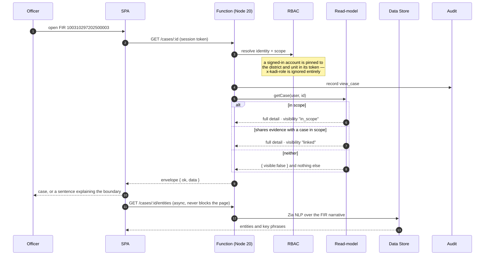
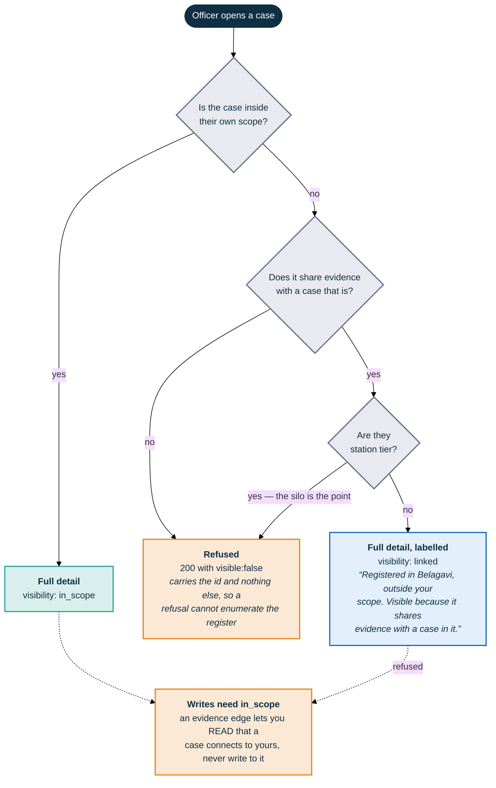
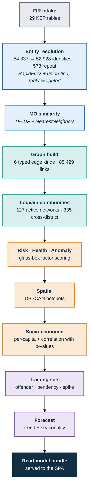

<div align="center">


# KADI — Karnataka Analytics & Detection Intelligence

**AI-Driven Crime Analytics & Visualization Platform for the Karnataka State Police**

*ಕಡಿ / कड़ी — "a link in a chain."*
Turning 59,985 siloed FIRs into one connected, explainable intelligence picture.

[](https://kadilabs-60078029367.development.catalystserverless.in/app/)
[](https://drive.google.com/drive/folders/1WY3KHg1WOEnSNTBXGmTtH2ZoJM1y4cLJ?usp=sharing)
[](https://catalyst.zoho.com/)
[](#testing)
[](#4-evaluation-and-results)
[](#fairness-is-an-invariant-not-a-policy)

**[Live Application](https://kadilabs-60078029367.development.catalystserverless.in/app/)** ·
**[Demo Video](https://drive.google.com/drive/folders/1WY3KHg1WOEnSNTBXGmTtH2ZoJM1y4cLJ?usp=sharing)** ·
**[Analytics API](https://kadi-appsail-50043957273.development.catalystappsail.in/analytics/socio)** ·
**[Documentation](docs/)**

*KSP Datathon 2026 · Challenge 02 · Team KadiLabs*

`crime-analytics` · `link-analysis` · `entity-resolution` · `graph-intelligence` · `police-technology`
`zoho-catalyst` · `serverless` · `machine-learning` · `forecasting` · `geospatial` · `react` · `typescript`
`explainable-ai` · `fairness` · `kannada` · `i18n` · `ocr` · `rbac` · `karnataka` · `ksp-datathon-2026`

</div>

---

<div align="center">

| | | | | | |
|:--:|:--:|:--:|:--:|:--:|:--:|
| **59,985** | **578** | **85,429** | **100%** | **0.870** | **8** |
| FIRs analysed | repeat offenders<br/>from 54,337 records | typed evidence links | ground-truth<br/>recovery | best model AUC<br/>(station pendency) | ML models<br/>serving |

*Every figure on this page is read live from the deployed API. Nothing is illustrative.*

</div>

---

## Table of Contents

**Understand it**
[The Problem](#the-problem) ·
[What KADI Does](#what-kadi-does) ·
[A Five-Minute Tour](#a-five-minute-tour) ·
[Screens](#screens) ·
[The Headline Finding](#the-headline-finding)

**How it works**
[System Architecture](#system-architecture) ·
[Request Flow](#request-flow) ·
[The Access Model](#the-access-model) ·
[Catalyst Services](#catalyst-services)

**The data and the models**
[1 · Data Sources](#1-data-sources) ·
[2 · Cleaning & Feature Engineering](#2-cleaning-and-feature-engineering) ·
[3 · Training](#3-training-approach) ·
[4 · Evaluation & Results](#4-evaluation-and-results) ·
[Fairness](#fairness-is-an-invariant-not-a-policy)

**Run it**
[Tech Stack](#tech-stack) ·
[Getting Started](#getting-started) ·
[Deployment & Infrastructure](#deployment--infrastructure) ·
[Project Structure](#project-structure) ·
[API Reference](#api-reference) ·
[Testing](#testing)

**The rest**
[Known Limitations](#known-limitations) ·
[Roadmap](#roadmap) ·
[Documentation](#documentation) ·
[Contributing](#contributing) ·
[License & Contact](#license--contact)

---

## The Problem

The Karnataka State Police maintains extensive crime records. The records are not the problem —
**the walls between them are.**

| Today | Consequence |
|---|---|
| FIRs sit in station-level silos, analysed in Excel | A station sees its own register and nothing else |
| No entity resolution across name spellings | "Ravi Kumar", "R. Kumar" and "Ravikumar D" are three people |
| SCRB receives fragmented extracts | No state-wide picture to act on |
| Reporting is retrospective | Policing stays reactive; no early warning, no forecast |
| Paper arrives faster than it is typed | A seizure memo is re-keyed by hand, or not at all |

A serial offender working across three districts is, in this arrangement, **invisible** — not
because the data is missing, but because nothing joins it.

---

## What KADI Does

<table>
<tr><td width="33%" valign="top">

### 🔗 Link Analysis

**Case-Linkage Graph**
Every FIR joined to every other FIR it shares real evidence with, across six typed link kinds.
Every edge is clickable proof — which attribute matched, on which FIRs.

**Entity Resolution**
Rarity-aware fuzzy matching resolves **54,337** accused records into **52,928** identities,
surviving spelling variants, initials and transliteration drift — and **578** of those turn up in
two or more FIRs. Those are the repeat offenders the watchlist tracks.

</td><td width="33%" valign="top">

### 🗺️ Spatial & Predictive

**Spatiotemporal Map**
Satellite basemap, district choropleth, DBSCAN hotspots, hour × weekday layering, pulsing
red-zones for emerging trends.

**Eight ML Models**
Repeat offending (six horizons), district × crime-head spike risk, and station pendency
trajectory — each benchmarked against the rule a supervisor would use instead, and shipped only
where it beat that rule.

**Socio-economic Analytics**
Per-capita rates correlated against urbanisation, literacy and density, with p-values so weak
signals are labelled weak.

</td><td width="33%" valign="top">

### ⚖️ Operations & Trust

**Investigation Health**
Flags cases slipping past detection timelines — reporting delay, ageing vs peer median, pendency,
undetected-risk, false-case patterns — each with a recommended action.

**Evidence Reading**
Photograph a seizure memo or a multi-page case diary; OCR, a vision model or a barcode scanner
reads it and the transcription files against the case.

**Bilingual Assistant**
Grounded EN / ಕನ್ನಡ Q&A by text or voice. Every answer cites real FIR numbers and deep-links into
the graph.

</td></tr>
</table>

---

## A Five-Minute Tour

The fastest way to understand KADI is to walk the path an investigator actually walks. Open the
[live application](https://kadilabs-60078029367.development.catalystserverless.in/app/) and:

1. **Start at the Command Dashboard.** 16,868 open cases, 16,136 carrying a serious flag, and the
   districts ordered by what needs attention rather than by name.
2. **Open any FIR, then its graph.** The ego-network shows every other FIR it shares evidence
   with. Click an edge: it names the attribute that matched and the FIRs it matched on.
3. **Switch to an SP or an SHO** from the account chip. The register narrows to their scope —
   server-side. Try opening a case in another district: you get a sentence explaining the
   boundary, and, if the case shares evidence with one of yours, the case itself marked as a
   linked read.
4. **Ask the Assistant** "which cases are slipping?" It answers with a count, cites five FIR
   numbers, and labels the answer *Computed from the records* / *Wording by the model*.
5. **Press ಕನ್ನಡ.** The whole interface turns over, including the answer you just received.

---

## Screens

*Nineteen route components. What each one is for, in one line.*

| Screen | What it shows |
|---|---|
| **Command Dashboard** | KPIs · monthly trend · hour × weekday heatmap · disposal funnel · forecast with 95% band · crime-mix radial · urbanisation bubble plot · district treemap |
| **Case-Linkage Graph** | Ego-network per FIR · 5 layouts · 6 link-type filters · "why linked" evidence panel · case switcher |
| **Cases** | 59,985 FIRs filterable by head, district, status, gravity, health flag |
| **Offenders** | Watchlist + profile: risk gauge · glass-box factor breakdown · name variants · linked FIRs |
| **Investigation Health** | Worklist of 26,168 flagged cases with plain-language reasons and next actions |
| **Map** | Satellite/streets basemap · district drill-down · DBSCAN hotspots · log-normalised heat grid · time-of-day filter |
| **Insights** | Per-capita ranking · rank-shift bars · correlation scatter · crime-mix by urbanisation band · state forecast |
| **React** | One ranked queue: failing cases, active offenders, pulsing stations, cases linking in from outside your scope — severity first, then urgency against the peer median |
| **Evidence** | Read a memo, notice or property tag — OCR, a vision model or a barcode scan — then file the transcription against a case. Multi-page and PDF. State tier only |
| **Forecast** | Statistical forecaster and ML forecaster side by side · emerging risk by z-score against each area's own history · lift-scored co-occurrence · projections with their backtest error |
| **Register** | File an FIR from a station; approve it as the SP. Lifecycle changes go through the same gate carrying before and after |
| **Assistant** | Bilingual grounded Q&A · voice input and read-aloud · per-answer translation · provenance labels · briefing export · RAG over a 12-document knowledge base |
| **Audit** | Every privileged read and write, with a human label per action |
| **Administration** | Access requests · fairness evaluation · data ingestion · model endpoint keys · what each rank sees |
| **Kannada review** | Correct the machine-written Kannada, one string at a time. Live immediately, attributed, reversible |
| **About** | Full platform, dataset and fairness documentation |

> **The whole interface is bilingual**, not just the answers. **1,134 strings** are pre-translated
> and committed; the translator refuses to touch FIR numbers, figures, dates and identifiers, so
> `100010064202600888` reads the same in either language. Translation, read-aloud and voice input
> all run on Zia's trained NLP models.

---

## The Headline Finding

Raw counts mostly measure **population**. Normalising to incidents per 100,000 residents changes
the map entirely:

| District | By raw count | Per 100k | FIRs | Rate |
|---|---:|---:|---:|---:|
| **Kodagu** | 30th | **6th** | 335 | 51.6 |
| **Dharwad** | 23rd | **7th** | 422 | 45.3 |
| Tumakuru | 10th | 24th | 806 | 25.7 |
| Belagavi | 4th | 14th | 1,859 | 33.2 |

335 FIRs looks unremarkable beside Bengaluru City's 16,895 — until you divide by Kodagu's 648,787
residents. **A count map would never surface it.**

**Socio-economic correlation** (n = 31 districts):

| Indicator | Pearson r | p | Strength |
|---|---:|---:|---|
| Population density | +0.871 | < 0.0001 | strong |
| Urbanisation | +0.88 | < 0.0001 | strong |
| Literacy | +0.546 | 0.0018 | moderate |

Urban districts run at **163.6** per 100k against **30.1** in rural ones — a 5.4× gap.

> ⚠️ **Stated openly:** the generator weights urban crime upward, so the urbanisation correlation
> is partly circular. The method is sound and runs unchanged on real KSP data — but this is
> confirmation, not discovery.

---

## System Architecture

*Five tiers, and the one constraint that decided the shape of all of them.*



### The constraint that shaped everything

> **No heavy compute behind an HTTP request.**

The pipeline peaks at **~740 MB** and runs **~25 s**. Catalyst Functions *and* AppSail both cap a
request at **30 seconds** — confirmed by the Zoho team in the Datathon workshop, and not raisable.
Only **Jobs** get 15 minutes.

So the pipeline runs as a Job on a nightly Cron, and the web tier only ever *reads* what the Job
already wrote. That single decision is why every screen loads instantly instead of waiting on a
model.

### The rule that shaped the assistant

> **The model never retrieves. It only phrases.**

Counts, citations, intents and actions are computed by deterministic code against the register
*before* any language model is called. The model is handed those facts and asked to write two
sentences. It cannot invent an FIR number because it is never in a position to look one up — and a
numeric guard rejects any phrasing that introduces a digit run absent from the facts.



---

## Request Flow

What actually happens when an officer opens a case:



The refusal is a **200 carrying `visible:false`**, not a 403 — so the interface can explain the
boundary instead of falling through to a generic error. It carries the id it was asked about and
nothing else, so a refusal cannot be used to enumerate the register.

---

## The Access Model

Three tiers, enforced **server-side**, on every read.

| Tier | Rank | Sees |
|---|---|---|
| **State** | DGP · Administrator · SCRB Analyst | All 31 districts. May drill into one and back out |
| **District** | SP · DSP | One district, **plus cases linked into it** |
| **Station** | SHO · SI | One police station's own register |

**The linked allowance is the product's whole argument.** A case registered in Belagavi opens for
a Bengaluru City SP *if it shares evidence with a Bengaluru case* — and the screen says so rather
than letting it pass for their own work. Measured live: over 12 out-of-district cases, an SP got
**6 linked, 6 refused**.

It deliberately stops at district tier. An SHO reading one register and seeing how much of it
connects to cases they cannot open is the silo the product argues against — you have to be able
to stand in it. Bengaluru Bazaar PS holds 276 cases and 617 more are one evidence edge away;
granting the station tier this would hand it 2.2× its own register and leave no silo to show.

Writes are stricter than reads: **an evidence edge lets you read that a case connects to yours,
never write to it.**



---

## Catalyst Services

*Thirteen in use, and an honest account of the six that are not.*

### In use — thirteen services

| Service | Used for | Why this service |
|---|---|---|
| **Web Client Hosting** | Serves the SPA at `/app` | Same origin as the API; deep links handled with a 404 → shell fallback |
| **Serverless Functions** | 105-endpoint REST API | Advanced I/O accepts an Express app; raised to 512 MB for the read-model |
| **Job Scheduling + Cron** | Nightly analytics revalidation, 02:00 IST | Only Jobs get 15 minutes |
| **AppSail** | Python analytics service | Per-capita + forecast in ~135 ms; stdlib-only build |
| **Data Store** | 19 tables · 59,985 FIRs · live ZCQL | The FIR schema is genuinely relational |
| **File Store** | Retained evidence pages | Opt-in image retention, deleted when its note is withdrawn |
| **Stratus** | Object storage for bulk import | Data Store bulk-write reads its source from a bucket |
| **Authentication** | 36 provisioned `@ksp.gov.in` accounts · 12 h token | A signed-in account is pinned to its district and unit |
| **Connections** | OAuth for QuickML and Zia | Both reject anonymous calls |
| **QuickML** | GLM-4.7 phrasing · Qwen 3.6 vision · RAG · 8 tabular models | The only place a model is allowed to run at request time |
| **Zia** | OCR · barcode · translation · TTS · STT · NLP entities | Trained models, no training data of ours required |
| **SmartBrowz** | Briefing export | Renders the print-ready briefing |
| **Cache** | — | Adapter written; see below |

### The honest inventory

| Item | State |
|---|---|
| **Cache** | Adapter written, segment provisioned. Writes from inside a deployed function return `401 PERMISSION_NEEDED`. Ruled out by test: segment id, SDK presence, scope API, table permissions. **Zero user impact** — the KPI query recomputes in ~1 ms |
| **Zia object recognition** | Every REST path tried returns **404** on this project. The vision model covers the same ground and is used instead |
| **Zia identity scanner** | Same: no reachable REST endpoint |
| **Zia face detection** | The endpoint exists and returns `ZIA_ERROR` on every image tried, including one containing a face. Left off rather than shipped as a control that fails |
| **NoSQL** | Never provisioned. The graph read-model ships in the function bundle; NoSQL is the right home at production scale |
| **API Gateway** | Enabled once, then disabled: with no routes configured it intercepted all traffic and the site returned `INVALID_URL`. Needs route configuration first |

> 💡 **Useful for anyone else building on Catalyst.** Three traps that cost real time:
> 1. A Connection created in Cloud Scale **cannot be read by `app.connection()`** — that API is
>    for *self-managed* connectors and fails with `client_id cannot be null`.
> 2. **Row-insert and file-upload responses return an id the record does not settle at.** A row
>    insert answered `…178070` for a row that queried back as `…178073`; a file upload answered
>    `…205060` for a file that listed as `…205058`. The offset is not constant. Mint your own keys
>    for rows; look files up by name.
> 3. **ZCQL refuses any `LIMIT` above 300** — as an error, not a truncation, so the whole query
>    returns nothing. Use `LIMIT offset, count` and page.

---

# The Data & ML Pipeline

## 1. Data Sources

> **Every FIR is synthetic.** No real case, person or complainant appears anywhere. Real KSP
> records cannot leave KSP — so the corpus is *generated*, but generated against the real schema,
> real geography and real published statistics.

| | |
|---|---:|
| FIRs | **59,985** (43 months, Jan 2023 – Jul 2026) |
| Districts | 31 (all real KSP districts) |
| Police stations | 298 |
| Accused / Victims | 54,337 / 74,799 |
| Repeat offenders | 578 |
| Typed evidence links | 85,429 |
| Planted ground-truth patterns | 7 |

**Real inputs the generator is built on:**

| Source | Used for |
|---|---|
| KSP table schema (29 tables) | Column names, types, the CrimeNo format |
| KSP crime taxonomy | Crime heads and sub-heads |
| IPC / BNS / IT Act / NDPS section lists | Acts and sections per case |
| District & station master (31 / 298) | Geography and the unit hierarchy |
| District polygons | Rejection-sampled coordinates — **100%** fall inside Karnataka |
| Census 2011 (population, literacy, urbanisation) | The per-capita denominator and correlations |
| National & state crime totals | Per-district magnitudes |

**Generation is deterministic** — seed `2026`, so the corpus regenerates byte-for-byte and every
figure here is reproducible.

**Seven ground-truth patterns are planted** — cross-district gang, serial burglary chain, cyber
ring, repeat offender, slipping cases, false-case cluster, emerging hotspot. Because they are
planted, the pipeline can be *scored* rather than admired.

<details>
<summary><b>Honest about fidelity</b></summary>

<br/>

| Genuinely real | Where the synthetic origin shows |
|---|---|
| District names, boundaries, geography | MO narratives are template-drawn — cleaner than real free text |
| Census 2011 population, literacy, urbanisation | Urbanisation correlation is partly circular by construction |
| KSP table schema and CrimeNo format | Names from a finite pool make resolution slightly easier |
| IPC / BNS / IT Act / NDPS section numbers | No missing fields, typos or duplicate registrations |
| Relative crime volumes between districts | Real registers are messier |

Full specification: **[docs/06_SYNTHETIC_DATA_SPEC.md](docs/06_SYNTHETIC_DATA_SPEC.md)**

</details>

---

## 2. Cleaning and Feature Engineering

The pipeline is 21 Python modules under [`appsail/pipeline/`](appsail/pipeline/). The stages that
matter:



### Entity resolution

Names arrive with spelling variants, initials and transliteration drift. Matching is
**rarity-aware**: a shared rare surname is worth far more than a shared common one. Candidates
are blocked, scored with RapidFuzz, and merged with union-find. **54,337 accused records → 52,928
identities**, of which **578** appear in two or more FIRs.

```mermaid
%%{init: {'theme':'base','themeVariables':{'fontSize':'15px','fontFamily':'ui-sans-serif, system-ui, sans-serif'}}}%%
flowchart LR
    R1["<b>54,337</b><br/>accused records<br/><i>“Ravi Kumar”, “R. Kumar”,<br/>“Ravikumar D”</i>"]
    R2["<b>Blocking</b><br/>candidates only, not<br/>every pair against every pair"]
    R3["<b>Rarity-weighted scoring</b><br/>a shared rare surname is worth<br/>far more than a common one"]
    R4["<b>Union-find merge</b>"]
    R5["<b>52,928</b><br/>resolved identities"]
    R6["<b>578</b><br/>appear in 2+ FIRs<br/><i>the watchlist</i>"]

    R1 --> R2 --> R3 --> R4 --> R5 --> R6

    classDef raw   fill:#E8EAEF,stroke:#64748B,stroke-width:2px,color:#0F2F44
    classDef step  fill:#E3F0FB,stroke:#1A6FC4,stroke-width:2px,color:#0F2F44
    classDef out   fill:#D8EFED,stroke:#2FA8A0,stroke-width:2px,color:#0F2F44
    classDef key   fill:#0F2F44,stroke:#0F2F44,color:#FFFFFF

    class R1 raw
    class R2,R3,R4 step
    class R5 out
    class R6 key
```



### The six typed link kinds

| Edge | Meaning |
|---|---|
| `shared_offender` | The same resolved identity appears on both FIRs |
| `co_accused` | Two identities that were named together elsewhere |
| `similar_mo` | Near-identical modus operandi (TF-IDF cosine over the narrative) |
| `same_location` | Incidents inside the same tight spatial cell |
| `same_time_window` | Registered within a narrow window of each other |
| `shared_section` | The same act and section combination |

Every edge carries the **attribute that matched and the FIRs it matched on** — the "why linked"
panel is reading stored evidence, not re-deriving a guess.

### Leakage control — one file per target

Each model gets its **own** training file, built with only the columns knowable at prediction
time. Sharing one wide table across targets is how a future-dated column silently leaks; a file
per target makes leakage a build-time question rather than a debugging one.

### Fairness is enforced *before* features are built

```python
# appsail/pipeline/common.py
PROTECTED_COLUMNS = {"ReligionID", "CasteID", "OccupationID", "caste_master_id",
                     "caste_master_name", "ReligionName", "OccupationName"}


def assert_no_protected(feature_columns) -> None:
    """Raise if any protected attribute appears in a model's feature set."""
    used = PROTECTED_COLUMNS.intersection(set(feature_columns))
    if used:
        raise ValueError(f"FAIRNESS VIOLATION: protected attributes in feature set: {sorted(used)}")
```

---

## 3. Training Approach

Everything is trained on **QuickML**, on a **time-ordered hold-out** — never a random split, which
would let a model see the future of the same station.

### The rule that decided almost everything

> **A model ships only if it beats the rule a supervisor would use instead.**

For every target there is an obvious heuristic — *most recent offender is most likely to reoffend*,
*the station with the most inflow will fall furthest behind*. Each candidate is scored against
that rule on the same hold-out. **A model that cannot beat the rule is not a model; it is
overhead.**

### The five tests a candidate has to survive

| Test | What it catches |
|---|---|
| **Beats the rule** | Overhead dressed as intelligence |
| **Scale-free** | A model that has only learned "big station is big" |
| **Conditional** | A composite target where one easy component carries the score |
| **Poisson floor** | A "spike" that is just counting noise on a small base |
| **Best-available baseline** | A weak rule chosen to make the model look good |

Every model is a **regressor on a 0/1 target**, so the output is a calibrated score rather than a
hard class — a supervisor ranks a worklist, they do not want a yes/no.

**Twelve candidates were built and rejected** — on the conditional test, the scale-free test, or
for losing to the rule outright. Four were rejected *despite* beating the rule, because the margin
did not survive a different split. That accounting is in
[docs/11_ML_MODELS.md](docs/11_ML_MODELS.md).

---

## 4. Evaluation and Results

### Ground-truth recovery — the planted patterns

| Pattern | Type | Recovery |
|---|---|---:|
| Cross-district chain-snatching gang (8 FIRs, 3 districts, 5 stations) | cluster | **100%** |
| Serial burglary chain (7 FIRs) | cluster | **100%** |
| Cyber-fraud ring — UPI/OTP (8 FIRs) | cluster | **100%** |
| Offender entity resolution (242 single-person identities) | identity | **85.9%** |
| Repeat offender out on bail → High risk band | risk | ✅ passed |
| Emerging MV-theft hotspot | hotspot | ✅ detected |
| **Overall** | | **100%** against a ≥ 90% target |

### The eight models that ship

All figures are **AUC on a time-ordered hold-out**, against the named rule.

**Repeat offending — six horizons, one panel**

| Slug | Question | AUC | Rule | Margin | AP | AP rule | Rows |
|---|---|---:|---:|---:|---:|---:|---:|
| `h90` | back on a new FIR within 90 days | **0.699** | 0.584 | +0.115 | 0.319 | 0.257 | 14,197 |
| `h180` | within 180 days *(default)* | **0.746** | 0.562 | +0.184 | 0.538 | 0.387 | 12,481 |
| `h365` | within a year | **0.733** | 0.512 | +0.221 | 0.720 | 0.517 | 9,153 |
| `new365` | next FIR in a district never worked | **0.762** | 0.561 | +0.201 | 0.452 | 0.309 | 9,153 |
| `heinous365` | next FIR recorded Heinous | **0.661** | 0.502 | +0.159 | 0.089 | 0.057 | 9,153 |
| `women365` | next FIR a crime against women | **0.638** | 0.459 | +0.179 | 0.040 | 0.021 | 9,153 |

**Spike risk and pendency**

| Task | AUC | Rule | Margin |
|---|---:|---:|---:|
| District × crime-head spike next month | **0.677** | 0.620 inverse recent level | +0.057 |
| **Station pendency +20% in 3 months** | **0.870** | 0.701 inflow over clearance | **+0.169** |

Station pendency is the widest margin in the project, and it **survives every robustness check**:

| Variant | AUC |
|---|---:|
| Shipped | 0.870 |
| **Scale-free** (every absolute volume stripped) | **0.860** |
| Earlier split | 0.871 |
| Later split | 0.807 |
| Restricted to backlog ≥ 25 | 0.835 |

> **Read the spike margin honestly.** +0.057 is thin. The target — 40% above the trailing mean —
> is easier to hit on a small base, and the Poisson floor test is what keeps that from being
> mistaken for signal.

### System performance

| Metric | Value | Note |
|---|---:|---|
| Pipeline runtime | **24.6 s** | full recompute over 59,985 FIRs |
| Peak memory | **738 MB** | was 1,770 MB — see below |
| AppSail analytics | **135 ms** | against a 30 s request cap |
| Graph payload | **54.9 → 12.1 MB** | interned; evidence text byte-identical |
| Forecast MAPE | **7.8%** | hold-out backtest, 3 withheld months |
| Zia OCR | **99%** confidence, ~2.0 s | typed seizure memo |
| Barcode scan | **127 ms** QR · **288 ms** Code-128 | against real generated codes |
| Vision model | **0.2 – 0.9 s** | free-text question over one image |
| Test suite | **74 passing** | Node + Python |

<details>
<summary><b>How peak memory fell from 1,770 MB to 738 MB</b></summary>

<br/>

Catalyst Jobs cap memory at **512 MB**, so the pipeline could not have run there at all.

Profiling showed **1,216 MB of the 1,770 was a single scratch buffer**: scikit-learn's brute-force
`kneighbors` sizes its distance block from `working_memory`, which **defaults to 1 GiB** — twice
the entire Job budget. Capping it at 32 MB via a scoped `config_context`:

| `working_memory` | Peak RSS | Time | Pairs | Result hash |
|---|---:|---:|---:|---|
| 1024 MiB (default) | 1471 MB | 1.6 s | 67,906 | `fe0d204c…` |
| 64 MiB | 560 MB | 1.6 s | 67,906 | `fe0d204c…` |
| 32 MiB | **362 MB** | 1.6 s | 67,906 | `fe0d204c…` |

**Byte-identical output, zero speed cost.** The work was always the same — sklearn was just
allocating a gigabyte to do it.

</details>

<details>
<summary><b>How the graph payload fell from 54.9 MB to 12.1 MB</b></summary>

<br/>

70% of the adjacency file was an evidence blob, and most of it was redundant:

- `sourceFIRs` was always `[thisCase, neighbour]` — both already known at read time
- `matched[].detail` drew from **362 unique sentences** written out **137,616 times**

Dropping the first and interning the second gives a **4.5× reduction** with the exact same text
rendering in the "why linked" panel. The API rehydrates through a `Proxy` that expands one case's
edges on access, so serving an ego-network never materialises the whole graph.

</details>

---

## Fairness is an invariant, not a policy

**Caste, religion and occupation never enter** entity resolution, linkage, risk scoring, or any
prediction — and that guarantee is *executable*. A unit test fails the build if any protected
column reaches a model's feature set.

**Explainability is enforced at every layer:**

| Layer | Guarantee |
|---|---|
| Every graph edge | Names the attribute that matched and the FIRs it matched on |
| Every risk score | Shows its factor breakdown, not just a number |
| Every assistant answer | Cites the FIR numbers it drew from, and labels its own provenance |
| Every model | Published with the rule it beat and by how much |
| Every privileged read | Written to an audit trail with a human-readable action label |

---

## Tech Stack

*Everything the project is built on, by layer.*

<table>
<tr><th align="left">Frontend</th><th align="left">Backend</th><th align="left">Data & ML</th><th align="left">Platform</th></tr>
<tr valign="top"><td>

React 18
TypeScript
Vite
Tailwind CSS
Cytoscape.js + fcose
MapLibre GL
Recharts
Framer Motion
TanStack Query
pdf.js

</td><td>

Node.js 20
Catalyst Advanced I/O
Express
RBAC middleware
Audit trail
Grounded intent engine

</td><td>

Python 3.11
scikit-learn
networkx (Louvain)
RapidFuzz
pandas · NumPy · SciPy
Shapely
QuickML

</td><td>

Zoho Catalyst
Catalyst CLI 1.27
ZCQL
Zia · QuickML · SmartBrowz
node:test · pytest

</td></tr>
</table>

---

## Getting Started

### Prerequisites

| Requirement | Version |
|---|---|
| Node.js | ≥ 20 |
| Python | ≥ 3.11 |
| Catalyst CLI | ≥ 1.27 (`npm i -g zcatalyst-cli`) — deployment only |

### 1 · Clone and install

```bash
git clone https://github.com/adarshcod30/Kadi.git
cd Kadi
```

```bash
python3 -m venv .venv && source .venv/bin/activate
pip install -r appsail/requirements.txt
```

```bash
npm --prefix functions install && npm --prefix client install
```

### 2 · Generate the corpus and run the pipeline

```bash
python -m data.generator.generate --seed 2026
```

```bash
python -m appsail.pipeline.run_pipeline
```

### 3 · Run it locally

```bash
npm --prefix functions start
```

```bash
npm --prefix client run dev
```

The SPA runs on `http://localhost:5173` and proxies `/api` to the local API on `:9000`.

### 4 · Deploy

```bash
npm --prefix client run build && catalyst deploy
```

### Environment

| Variable | Default | Purpose |
|---|---|---|
| `KADI_BACKEND` | `mock` | `mock` reads generated files; `catalyst` uses SDK adapters |
| `DATA_DIR` | `data/output` | Where the generator writes |
| `QUICKML_ENABLED` | `true` | LLM phrasing, RAG and the tabular models |
| `ZIA_ENABLED` | `true` | OCR, barcode, translation, TTS, STT |
| `EVIDENCE_FOLDER_ID` | `55468000000217062` | File Store folder for retained pages |

---

## Deployment & Infrastructure

| | |
|---|---|
| **Hosting** | Zoho Catalyst — project `KadiLabs` (`55468000000013048`), org `60078029367` |
| **Environment** | Development (Live project type) |
| **Web tier** | Catalyst Web Client Hosting, served at `/app` |
| **API tier** | Catalyst Advanced I/O Function `api`, Node 20, 512 MB, 30 s cap |
| **Batch tier** | Catalyst Job `refreshanalytics` on a Cron at **02:00 IST**, 15-min budget |
| **Python tier** | Catalyst AppSail `kadi-appsail`, stdlib-only build |
| **Storage** | Data Store (19 tables) · File Store (evidence pages) · Stratus (bulk import) |
| **Deploy command** | `catalyst deploy` — all four targets from one command |
| **Monitoring** | Catalyst logs; `/health`, `/ai/status`, `/diag/*` report live service state |

### CI / verification

There is no external CI runner; verification is local and reproducible:

```bash
cd functions && npm test        # 74 tests — API, RBAC, scope, evidence, i18n, invariants
cd client && npx tsc --noEmit   # typecheck
```

Several tests are **structural assertions against the source**, deliberately — they fail if a
route ordering, a scope check, an audit label or a build setting regresses. A boundary that is
only remembered is a boundary that eventually moves.

---

## Project Structure

*Where to look for what.*

```
Kadi/
├── client/                     React SPA — Catalyst Web Client Hosting
│   ├── src/pages/              19 route components (Dashboard · Graph · Evidence · Kannada …)
│   ├── src/features/graph/     Cytoscape canvas + "why linked" evidence panel
│   ├── src/components/         Shell · shared UI · illustrations · AboutSections
│   ├── src/api/hooks.ts        TanStack Query hooks
│   └── src/lib/
│       ├── i18n.ts             4-layer EN / ಕನ್ನಡ translation
│       ├── kn.json             1,134 committed Kannada strings
│       ├── PageTranslator.tsx  DOM-level translation + reverse-dictionary restore
│       └── pages.ts            PDF / multi-image → page list (lazy pdf.js)
│
├── functions/
│   ├── api/                    Advanced I/O Function — the REST API
│   │   ├── app.js              105 routes · RBAC + audit wiring
│   │   ├── services/           29 modules — queries · rbac · assistant · audit · quickml
│   │   │                       zia · zianlp · ziavision · vlm · filestore · evidencenote
│   │   │                       translationfix · submissions · forecasting · mlforecast …
│   │   └── data/               deployable bundle (built by build_bundle.py)
│   ├── refreshanalytics/       Catalyst Job — nightly analytics revalidation
│   └── test/api.test.js        74 tests
│
├── appsail/                    Python analytics — Catalyst AppSail
│   ├── app.py                  stdlib-only HTTP service
│   ├── pipeline/               21 modules — entity_resolution · mo_similarity · graph_build
│   │                           community · risk_score · health_metrics · anomaly · spatial
│   │                           socio · forecast · training_set · offender_set · pendency_set
│   │                           demographics · zones · occasions · evaluate · build_bundle
│   ├── jobs/                   Job entry points
│   └── tests/                  pytest suite incl. the fairness invariant
│
├── data/
│   ├── generator/              Synthetic FIR generator (5 modules, seed 2026)
│   └── output/                 Generated CSVs + derived read-model (gitignored)
│
├── research/                   Model selection notebooks and the rejected candidates
├── scripts/                    UI-string extraction · Kannada dictionary build · seeding
└── docs/                       16 documents — PRD · TRD · schema · ML · assistant · evidence
```

---

## API Reference

*105 endpoints; the ones worth knowing about, and two queries you can run right now.*

Base URL (deployed):
`https://kadilabs-60078029367.development.catalystserverless.in/server/api`

A signed-in account carries a session token that pins its district and unit. The demo path
accepts `x-kadi-role` — `DGP` · `Admin` · `Analyst` · `SP` · `DSP` · `SHO` · `SI`.

Every response is enveloped: `{ ok: true, data }` or `{ ok: false, error: { code, message } }`.

| Method | Endpoint | Returns |
|---|---|---|
| `GET` | `/health` · `/me` | Liveness · current user, capabilities, fairness statement |
| `GET` | `/stats` | Dashboard KPIs, trend, heatmap, status breakdown |
| `GET` | `/cases` | Paged FIR list — filter by head, district, status, gravity, flagged |
| `GET` | `/cases/:id` | Full FIR, or `{ visible:false }` with the reason |
| `GET` | `/cases/:id/entities` | Zia NLP entities and key phrases from the narrative |
| `GET` | `/graph/case/:id` · `/graph/cluster/:id` | Ego-network · full community subgraph |
| `GET` | `/offenders` · `/offenders/:id` | Watchlist and glass-box risk profile |
| `GET` | `/health/cases` · `/health/summary` | Investigation-health worklist and rollup |
| `GET` | `/geo/points` · `/grid` · `/hotspots` · `/districts` | Map layers |
| `GET` | `/analytics/socio` · `/forecast` · `/worklist` · `/agenda` | Analytics surfaces |
| `GET` | `/eval` · `/ai/status` | Ground-truth recovery · which AI services are wired |
| `POST` | `/assistant/query` · `/voice` · `/document` | Grounded bilingual Q&A · voice · one image |
| `POST` | `/evidence/:capability` | OCR / barcode over an uploaded image *(state tier)* |
| `POST` | `/evidence/note` | File a reading against a case |
| `GET` | `/cases/:id/evidence` | Readings filed against a case, at the case's scope |
| `POST` | `/evidence/note/:id/page` · `/reread` | Keep the page · read it again with another engine |
| `GET` | `/translations/overrides` · `POST /translations` | Kannada corrections in force · write one |
| `POST` | `/submissions` · `/case-updates` | Register an FIR · request a lifecycle change |
| `GET` | `/audit` | Audit trail *(SP and above)* |

**The headline finding, straight from the API:**

```bash
curl -s "https://kadilabs-60078029367.development.catalystserverless.in/server/api/analytics/socio" -H "x-kadi-role: Analyst" | jq '.data.districts[] | select(.rankShift > 5) | {district: .districtName, byCount: .rankByCount, byRate: .rankByRate, rate: .ratePer100k}'
```

**Or in ZCQL, against Catalyst Data Store:**

```sql
SELECT DistrictName, TotalCases, RatePer100k, RankByCount, RankByRate, RankShift
FROM DistrictInsight WHERE RankShift > 5 ORDER BY RankShift DESC
```

---

## Testing

```bash
cd functions && npm test
```

```bash
pytest appsail/tests data/generator -q
```

**74 Node tests** covering the envelope, RBAC scoping at all three tiers, the scope refusal in
both directions, evidence filing and retention, translation corrections, and a set of structural
invariants — audit labels, route ordering, ZCQL limits, build output. Plus the **Python fairness
invariant**, which fails the build if any protected attribute reaches a feature set.

---

## Known Limitations

*Eight of them, each verifiable on the live URL — plus one that is a decision rather than a gap.*

Stated plainly — every one is verifiable on the live URL.

| # | Limitation | Detail |
|---|---|---|
| 1 | **The register reads a bundle, not Data Store** | 59,985 FIRs are genuinely in Data Store and queryable via ZCQL (`?source=datastore` proves it), but the default read path serves a precomputed bundle for sub-100 ms response |
| 2 | **The Kannada is machine-written** | 1,134 strings, of which a fraction of one percent has been read by a Kannada speaker. The review screen makes that fixable incrementally; it does not pretend it is fixed |
| 3 | **Three Zia image services do not answer** | Object recognition and identity scanner 404 on every REST path; face detection returns `ZIA_ERROR`. Stated on the Evidence screen rather than mocked |
| 4 | **One image per reading is retained** | A multi-page document files as one reading, but only its first page can be kept |
| 5 | **No PDF text layer** | PDF pages are rasterised and OCR'd, so a PDF that already contains text is read as a picture of it |
| 6 | **Cache is not writable** | See [Catalyst Services](#catalyst-services). Zero user impact |
| 7 | **ZCQL joins need declared FKs** | Our columns are plain ints, so aggregates and filters work but `JOIN` does not |
| 8 | **Correlation is partly circular** | The generator weights urban crime upward — see [The Dataset](#1-data-sources) |

### There is no face matching, and there will not be

Not a limitation to be lifted later — **a decision.** Zia offers no 1:N face search, this corpus
carries no photographs of people, and a "match" assembled from neither would be a fabricated
identification handed to someone with arrest powers.

Counting the people in a scene is a contemporaneous note. Naming them is an accusation, and a
general vision model is not entitled to make one.

---

## Roadmap

| Priority | Item | Effort |
|---|---|---|
| 1 | Read the register from Data Store via ZCQL behind the existing store interface | Medium |
| 2 | Native-speaker Kannada review — the instrument exists, the review does not | Ongoing |
| 3 | Retain every page of a multi-page reading, not only the first | Small |
| 4 | Extract a PDF's own text layer instead of rasterising it | Small |
| 5 | Signals on FIR insert → incremental recompute instead of nightly rebuild | Medium |
| 6 | Extend the graph: vehicle numbers, phone/IMEI, bank accounts as link types | Medium |
| 7 | Configure API Gateway routes and re-enable it | Small |

---

## Documentation

*Sixteen documents in [`docs/`](docs/), written as a build guide rather than a spec archive.*

| # | Document | What it covers |
|---|---|---|
| **00** | [**KADI, end to end**](docs/00_PROJECT_ANATOMY.md) | **Start here.** Every part verified against the code, including what is stale or unfinished |
| 01 | [What you are building, and why](docs/01_PRD.md) | Problem, personas, every feature with its status, the access matrix |
| 02 | [How it is wired](docs/02_TRD.md) | Architecture, the Catalyst services, the API surface, the performance work |
| 03 | [The data contract](docs/03_DATABASE_SCHEMA.md) | KSP source schema verbatim, the tables KADI adds, Catalyst type traps |
| 04 | [How it should look and feel](docs/04_UI_UX_GUIDELINES.md) | Design tokens, the shell, every screen, accessibility |
| 05 | [App flow and build order](docs/05_APP_FLOW_AND_IMPLEMENTATION_PLAN.md) | Sitemap, journeys, sequences, the phased build |
| 06 | [The synthetic corpus](docs/06_SYNTHETIC_DATA_SPEC.md) | Generator design, volumes, the seven planted patterns |
| 07 | [Catalyst setup runbook](docs/07_CATALYST_SETUP.md) | Clone to live URL, the real `catalyst.json`, six traps |
| 08 | [What is live right now](docs/08_CATALYST_LIVE.md) | Verified deployment state and table ids |
| 09 | [The overhaul](docs/09_OVERHAUL_PLAN.md) | The seven-phase rework and the decisions behind it |
| 10 | [React & Forecast](docs/10_REACT_FORECAST_PLAN.md) | The ranked queue and the forecasting surfaces |
| **11** | [**The ML models**](docs/11_ML_MODELS.md) | The eight that ship, the twelve that did not, and why |
| **12** | [**The assistant**](docs/12_ASSISTANT.md) | Four kinds of answer, and why it does not hallucinate |
| **13** | [**Evidence**](docs/13_EVIDENCE.md) | Reading paper, filing it, and what retention guarantees |
| **14** | [**Kannada**](docs/14_KANNADA.md) | The four translation layers and how a correction is made |
| — | [Access credentials](docs/ACCESS_CREDENTIALS.md) | Provisioned demo accounts |

---

## Contributing

This is a Datathon submission rather than an open project, but the codebase is written to be
picked up cold and the conventions are worth stating:

1. **Read [`docs/00_PROJECT_ANATOMY.md`](docs/00_PROJECT_ANATOMY.md) first.** It is the honest
   inventory, including what is wrong.
2. **A boundary that is only remembered is a boundary that moves.** If you add a rule — a scope
   check, an audit label, a route ordering — add the test that fails when it regresses.
3. **Comments explain *why*, not *what*.** Several in this codebase document a bug that was
   actually hit; those are the valuable ones.
4. **Never let a protected attribute near a feature set.** The build will stop you, but do not
   make it have to.
5. **Measure, do not assert.** Every number in this README came from the deployed API or a test
   run, and it should stay that way.

```bash
cd functions && npm test && cd ../client && npx tsc --noEmit
```

---

## License & Contact

Built for the **Karnataka State Police** · KSP Datathon 2026 · Challenge 02.
The synthetic corpus, pipeline and application code are the work of Team KadiLabs.

| | |
|---|---|
| **Author** | Adarsh Dwivedi ([@adarshcod30](https://github.com/adarshcod30)) |
| **Repository** | [github.com/adarshcod30/Kadi](https://github.com/adarshcod30/Kadi) |
| **Live** | [kadilabs-60078029367.development.catalystserverless.in/app](https://kadilabs-60078029367.development.catalystserverless.in/app/) |
| **Demo** | [Google Drive](https://drive.google.com/drive/folders/1WY3KHg1WOEnSNTBXGmTtH2ZoJM1y4cLJ?usp=sharing) |

### Submission artefacts

| Artefact | Location |
|---|---|
| **Deck** | [`docs/deck/KADI_KSP_Datathon_2026_Submission.pptx`](docs/deck/) — 20 slides, official template |
| **Prototype brief** | [`docs/deck/PROTOTYPE_BRIEF.txt`](docs/deck/PROTOTYPE_BRIEF.txt) — 972 / 1024 characters |
| **Demo video** | [Google Drive](https://drive.google.com/drive/folders/1WY3KHg1WOEnSNTBXGmTtH2ZoJM1y4cLJ?usp=sharing) |
| **Live deployment** | [Catalyst](https://kadilabs-60078029367.development.catalystserverless.in/app/) |

---

<div align="center">

**Built for the Karnataka State Police · KSP Datathon 2026 · Challenge 02**

*ಒಳನೋಟಗಳು ಸಾಕ್ಷ್ಯ ಮತ್ತು ವರ್ತನೆಯನ್ನು ಮಾತ್ರ ಬಳಸುತ್ತವೆ — ಜಾತಿ, ಧರ್ಮ ಅಥವಾ ಉದ್ಯೋಗವನ್ನು ಎಂದಿಗೂ ಅಲ್ಲ.*
*Insights use evidence and behaviour only — never caste, religion, or occupation.*

[Live Application](https://kadilabs-60078029367.development.catalystserverless.in/app/) ·
[Demo Video](https://drive.google.com/drive/folders/1WY3KHg1WOEnSNTBXGmTtH2ZoJM1y4cLJ?usp=sharing) ·
[Documentation](docs/) ·
[The ML Models](docs/11_ML_MODELS.md) ·
[Live State](docs/08_CATALYST_LIVE.md)

<sub>Team KadiLabs · Adarsh Dwivedi</sub>

</div>
